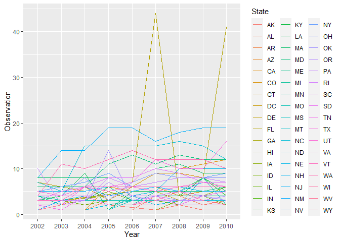

Homework 2
================
Haolin Wu
2/10/2022

## Question 3

##Problem 3.1

``` r
#Read the data
data <- read.csv(file.choose(), header=TRUE)
data <- as_tibble(data)
##Clean the data and select the variables
overall_health <- data %>% 
  filter(Topic == 'Overall Health') %>%
  mutate(Locationdesc = factor(Locationdesc),
         County = substring(Locationdesc, 5))%>%
rename(State = Locationabbr, Prop_response = Data_value)%>%
  select(Year, State, County, Prop_response, Response, Sample_Size)%>%
  mutate(Year = factor(Year),
         State = factor(State),
         Prop_response = factor(Prop_response),
         Response = factor(Response),
         County = factor(County),
         Sample_Size = factor(Sample_Size))
```

##Problem 3.2

``` r
#Number of Variables:
n.variables <- ncol(overall_health) ## 6
#Number of Observations:
n.observation <- nrow(overall_health) ##10625
```

## Problem 3.3

# Problem 3.3.1

``` r
six_observed_state <- overall_health %>%
  filter(Year == 2004) %>%
  group_by(State) %>%
  mutate(location_observed = length(unique(County)))%>%
  filter(location_observed == 6)
##There are only two counties: Adams and Arapaheo
```

#Problem 3.3.2

``` r
overall_health %>%
  group_by(State, Year) %>%
  summarize(location_observed =length(unique(County))) %>%
# summarize(mean_observed = mean(location_observed)) %>%
ggplot(aes(x = Year, y = location_observed, group = State, colour=State, legend = 'State')) + geom_line()+ ylab('Observation')
```

    ## `summarise()` has grouped output by 'State'. You can override using the `.groups` argument.

<!-- -->
